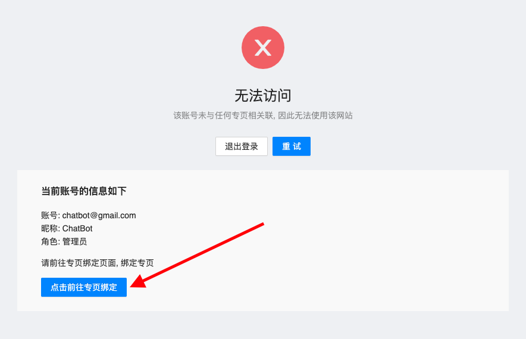
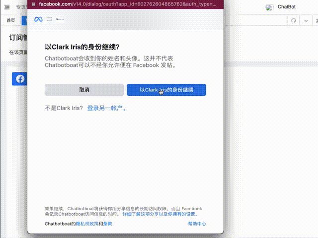

# 权限

当我们申请到一个 `专页管理员` 账户时，首先该做什么呢？看完此篇，你就能明白

## 绑定专页

1. 点击页面下方蓝色的 `点击前往专页绑定` 按钮

2. 点击蓝色的 `facebook` 登录按钮（如果没有当前浏览器没有登录 `fb` 账户，会显示登录按钮，如果一登录，会显示以登录账户身份继续）。点击按钮后出现绑定弹框

3. 点击右边的 `以XX身份继续` 按钮，然后只勾选需要绑定的专页，点击确定和完成, 最后再点击 `点击连接` 按钮，出现成功提示时即绑定专页成功。

## 结尾

🍀 专页绑定成功后，就去设置 `成长工具` 吧。

>本章只是针对专业管理员权限的账户做了介绍，如果使用普通用户或畅聊账户，请查看 [专页管理](./page/add_role.md) 章节