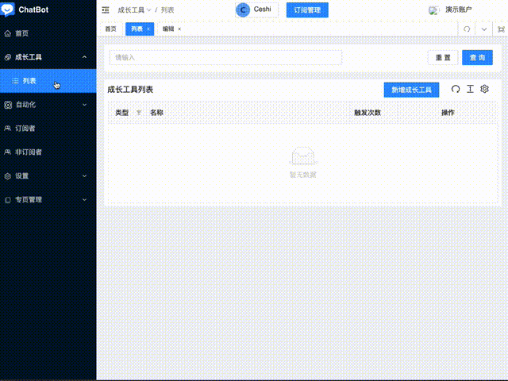

# 快速开始

## 目标

通过本章学习，你的专页将能 `自动回复留言` 并给评论用户发送私信

## 前提

* 拥有一个 `管理员` 权限的账户

* 拥有一个 `FB` 账户，并且拥有至少一个 `专页`

## 开始操作

### 登录账户

1. 首先选择正确的网址登录，机器人有至少三个站点，例如

* [一号](https://chat.dochatbot.com)

* [二号](https://second.dochatbot.com)

* [三号](https://third.dochatbot.com)

2. 输入账户名、密码，勾选【我同意 ChatBot 的隐私权政策与使用条款】，然后点击【登录】

### 绑定专页

1. 第一次登录成功后，系统会提示你需要绑定专页，所以请点击蓝色按钮【点击前往专页绑定】

2. 点击 `fb` 登录按钮

3. 绑定专页

到此为止，你已经成功绑定了自己的专页，接下来开始设置评论成长工具吧。😊

### 设置评论成长工具

* 点击页面左侧的 【成长工具】 > 【列表】

* 点击右上角的蓝色按钮 【新增成长工具】，选择 `评论` 类型

* 开启 `跟踪所有文章`，表示专页下的所有帖文都会触发此成长工具

* 点击【下一项】，并添加一条回复。教程中使用了 `full_name` 魔术字段，指的是取评论用户的全名。例如当**Ari Lee**用户评论时，`chatbot` 会使用 `Ari Lee` 来替换 `full_name` 魔术字段

* 设置五秒的延迟时间，并开启随机。此举是避免 `chatbot` 每次都立即回复，被 `fb` 检测为虚假评论

* 设置完毕后，点击页面下方的【保存】按钮

***🎉 恭喜你，到此为止，你的专页已经能自动回复评论了！***

---

### 后续

现在设置完毕后，专页能给评论用户发送一条消息，“hello 😊”, 但这是固定的，并且只有一条。如果想让用户看到消息后能继续走流程，请看 [工作流](./workflow/demo.md) 章节...