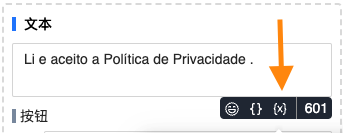

# 自定义变量

可以理解为给特定内容取个 `别名`，然后可以在流程中可以用设定好的别名代替内容

## 为什么会出现变量这个功能

变量的出现是为了让流程更加 `通用化`。许多专页的流程除了畅聊链接或者 `Messenger 小组链接` 不同，其他都相同。如需使用同一份工作流，除了、复制整个工作流外，还要修改每一个链接。假如流程中的链接使用变量指代，并且每个专页事先建好 `同名变量`，那只需要复制工作流即可。当系统在发送消息时会自动将所有变量替换为其预先设定的内容

另外一方面，许多客服人员没有系统账户却需要修改流程。变量的出现，将流程特定内容从工作流中抽离出来，客服人员可以通过更新变量来间接更新工作流。保证一定安全性的同时，使得流程设置更加开放。变量通过谷歌脚本在外部批量更新，[点击此处设置脚本](https://docs.google.com/document/d/1hvunydF7WMhEzBspuHfLmn0bCSJg7X2g4CwfwJsaRl8/edit#)

## 新建变量

- 变量名字数最多 30 个
- 变量名中不能包含特殊字符，只能有字母、数字、下划线
- 变量名不允许重复，一个专页下的所有变量名必须是唯一的
- 变量的值字数不能超过 600 个
- 目前变量的数据类型只支持文本

::: warning
因为系统是实时读取变量内容的，所以一旦变量内容有更新或删除都会立即影响到流程。所以更新前务必确认内容是否正确。如果变量被删除或不存在，流程不会报错，但变量的内容会被视为空
:::

## 使用变量

在任何可以使用魔术字段的地方都能使用变量，点开花括号右侧的，能在魔术字段列表的右侧找到自定义变量栏目

