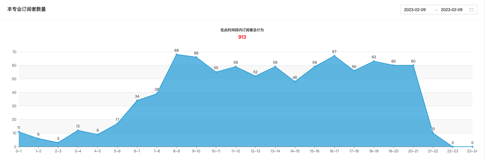

# 首页统计

## 订阅者走势图

可根据时间段统计当前专页订阅者数量，支持统计 `1～30` 之内的数据

## 多专页订阅者走势图

在同一个页面中同时查看多达 `20` 个专页的订阅者数据，并高亮统计图背景色区分不同数量的来人情况。此功能支持手动刷新，最多 5 秒一次。默认情况下，5 分钟会自动刷新

::: tip
走势可以通过背景色来快速判断
:::

蓝色，来人量较少，每小时订阅者数 < 150

绿色，爆贴初期， 150 < 每小时订阅者数 < 200

红色，爆贴期间， 每小时订阅者数 > 200