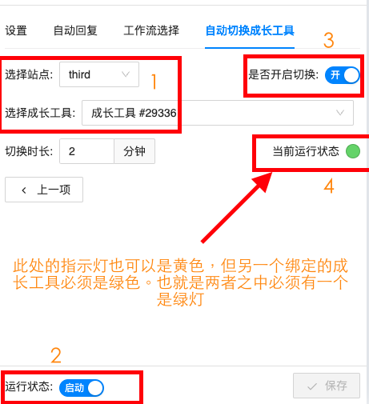

# 双平台切换评论成长工具

允许定时切换走流程的平台，比如 `Chat` 发五分钟消息后，让 `Second` 发三分钟消息，避免短时间内一个平台发送大量信息受限。

::: warning
此功能目的是为了缓解「API 速率受限」问题，请不要滥用，没出现问题的专页请别使用，因为会给服务器带来不必要的压力。如使用过此功能，现在不用的也请断开其中一个平台的权限
:::

::: tip
使用此方法并不是解决 api 速率受限的最佳办法。往往在流程中已使用频率限制能起到很好的效果，所以在使用此方法前请确认在流程中已使用频率限制
:::

## 录屏

可从 `1 分 48 秒` 处开始播放正题

<iframe width="560" height="315" src="https://www.youtube-nocookie.com/embed/fhXzLU_EBDs" title="YouTube video player" frameborder="0" allow="accelerometer; autoplay; clipboard-write; encrypted-media; gyroscope; picture-in-picture; web-share" allowfullscreen></iframe>

## 评论能自动切换的条件

必须有绑定的成长工具，开启切换状态并且当前或者绑定的成长工具运行状态指示灯是绿灯。如下图

## 三种状态开关的说明

- 左下角的 「运行状态」 控制整个成长工具是否启用，如果此处关闭，那么必定没有流程和评论，也记录不了线索
- 右上角的 「是否开启切换」 控制绑定好的成长工具能否开始切换，此处如果关闭，必定不会切换
- 页面中间的 「当前运行状态」 表示是否轮到当前成长工具走流程发评论，如果是绿灯，表示轮到，否则未轮到

## 错误通知

开启 「设置」 > 「通用设定」 中的响铃通知和弹窗通知，可以在切换失败时收到通知

::: warning
1. 当前「运行状态」并不是实时自动更新的，请勿停留在此页面等待其变化，想看最新状态请刷新
1. 上述页面中的配置必须保存后才生效
1. 数据可以某一个平台为主，因为切换两方的评论成长工具都是开启的，都能记录数据。所以数量一定是准确的，只不过流程中打的标签不准确
:::