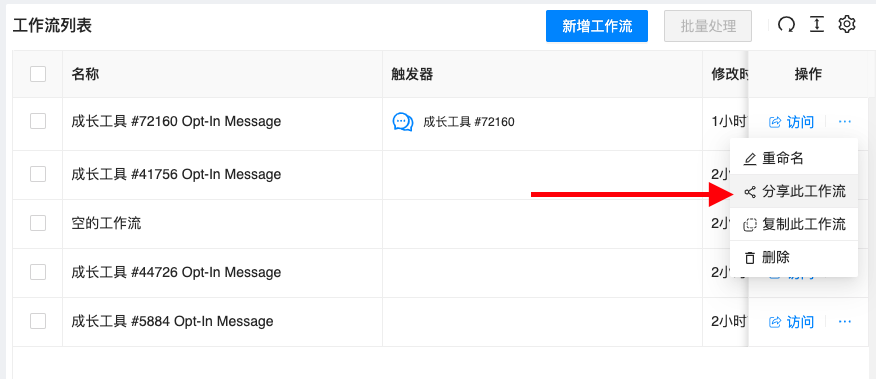
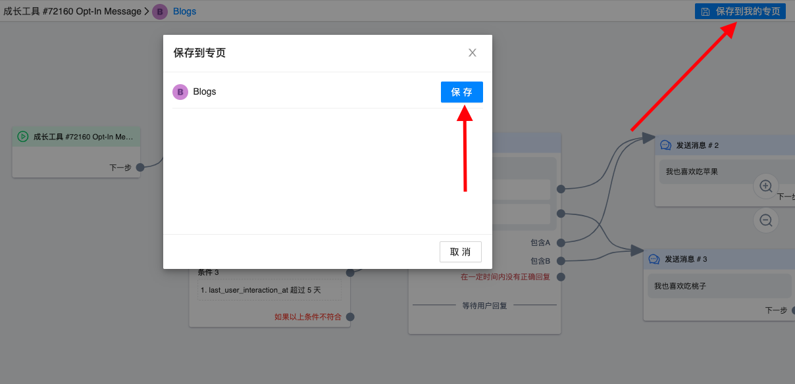

# 进阶技巧

## 跨平台跨专业批量复制节点

按住 `Shift`, 选择一个或多个要复制的节点，使用 `Command/Ctrl  + c` 复制，然后在任意工作流编辑页面按 `Command/Ctrl + v`, 便会粘贴节点。复制速度主要取决于图片、文件、视频的数量。

## 批量移动节点

按住 `Shift` 并用鼠标框选多个节点，可以批量移动节点

## 批量删除节点

按住 `Shift` 并用鼠标框选多个节点，点击绿色框选区域左上方的 `垃圾桶` 删除按钮，即可批量删除

## 分享工作流

工作流列表页面点击三个点按钮，展开后有 `分享此工作流` 按钮，点击即可获取到分享链接。任意一个人获取到链接都能在登录系统后打开链接查看。

::: warning
此功能无法跨平台，只支持同一个平台内不同专业间使用
:::

## 复制分享工作流

打开分享链接后，会看到分享工作流的预览状态。你可以点击页面右上方蓝色的 `保存到我的专页` 按钮，在弹出的专页列表中点击对应的「保存」按钮，复制工作流到指定的专页中