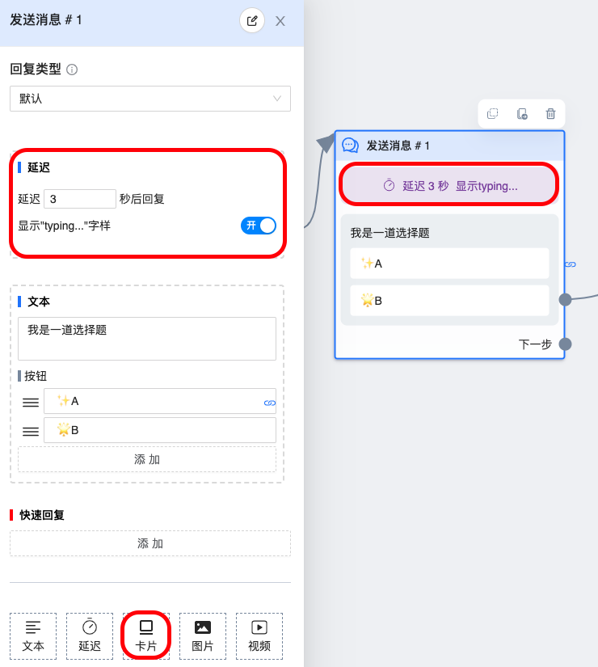

# 延迟组件

`延迟组件` 又叫 `气泡组件`，因为使用此组件后在用户那会看到 `正在输入的气泡显示`, 这样的效果让聊天更加真实。

## 图鉴

## 使用说明

- 延迟组件不能作为节点中的最后一个组件

- 气泡效果可以选择性关闭

## 常见问题

### 为什么开启了气泡效果，但没有看到效果

因为 `气泡效果` 受欧洲、日本隐私权政策影响，可能会导致这些地区的专页无法正确显示效果

### 与延迟节点的区别

两者有两个主要区别：

- 显示效果不同。`延迟组件` 有气泡效果，而 `延迟节点` 什么效果都看不出来

- 延迟时间也不同。`延迟组件` 最多设置 30 秒，而 `延迟节点` 最多设置 24 小时