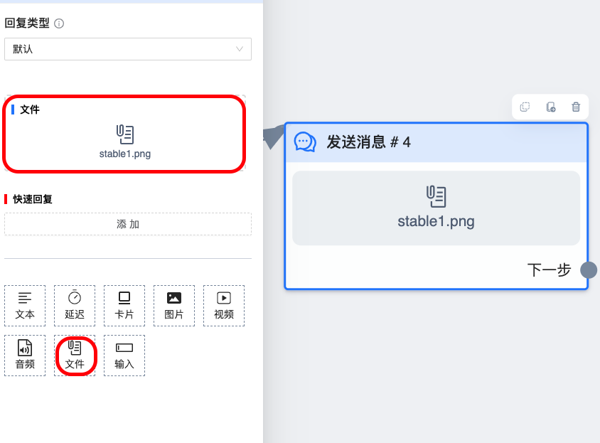

# 文件组件

给用户发送指定文件，此文件仅供下载，无法预览

## 图鉴

fb 中的实际效果

## 使用说明

虽然系统中能上传所有格式的文件，但 `fb` 不一定支持，所以上传完后一定要检查下，流程中是否能发送此文件。

**注意**所有涉及上传的功能可以通过查看 「设置」>「日志」 来检查是否上传成功，如果遇到 `上传附件失败` 此报错时，请检查文件内容是否异常。一般是 `fb` 检测到文件内容有问题才会提示此报错，或许是空文件，亦或是违反政策的内容
