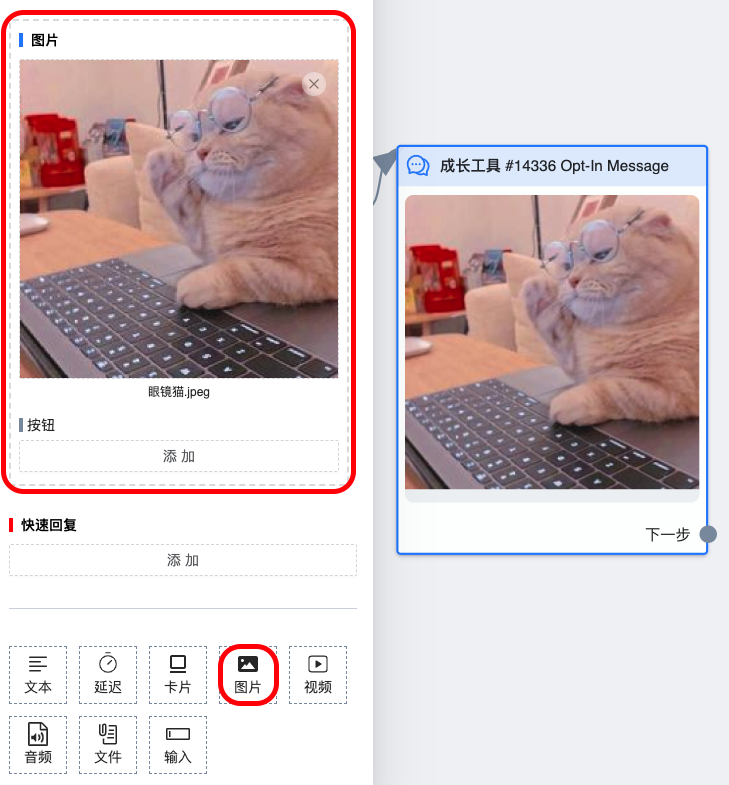

# 图片组件

此组件常用于发送单张图片，图片下最多可以附带三个普通按钮

## 图鉴

fb 上的实际效果

## 使用说明

### 上传图片

可以点击灰色的可上传区域，在弹框中选择图片即可。也可以直接拖拽本地图片到灰色的上传区域中，上传完成后会显示出图片缩略图

### 删除图片

在文件缩略图的右上角有一个白色背景的删除按钮，点击后即可删除图片

## 常见问题

### 能上传多大的图片

2.5 M

### 图片在系统里上传成功，但流程里不显示怎么办

回到系统里重新发布流程，如果还是不显示就删除图片重新上传，上传成功五秒钟后再发布

### 能上传动态图吗

可以上传 `gif` 图