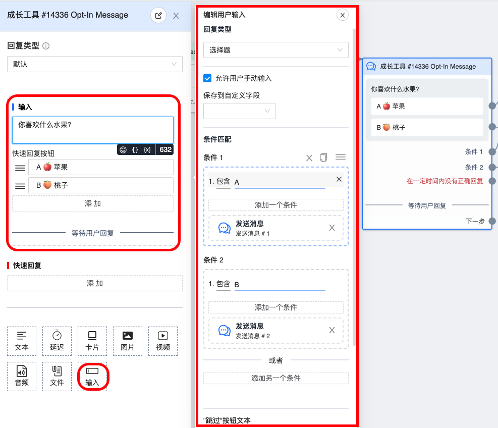

# 输入组件

此组件能针对用户消息内容，根据条件走流程或一定时间后自动走流程。主要有以下三个用途

- 针对不选按钮而是发消息选择，如手打 `A` 的用户，使其能顺利走 `A` 后的流程

- 自动保存用户报出的电话号码

- 用户不回复消息时，一定时间后自动往下走流程

## 图鉴

fb 中的实际效果

## 使用说明

## 录屏

<iframe width="560" height="315" src="https://www.youtube-nocookie.com/embed/SIr9GuVKeKY" title="YouTube video player" frameborder="0" allow="accelerometer; autoplay; clipboard-write; encrypted-media; gyroscope; picture-in-picture; web-share" allowfullscreen></iframe>

### 回复类型

设置前务必确认应用场景，如果是第一种用途，输入组件中的 `回复类型` 一定要选择 `选择题`，并开启「允许手动回复」，因为只有 `选择题` 类型的才支持按钮。如果是第二种用途，`回复类型` 请选择 `电话号码`，这样能出现「保存至系统字段」选项，然后才能被同步脚本获取到。至于「保存到自定义字段」需要配合自定义字段使用，很少用到，不做描述。

### 条件匹配

`条件匹配` 允许设置多组条件，每一组条件可以由多个条件构成。条件间的关系规则，和 [条件节点](
    /guide/workflow/node/condition.html#条件体
    ) 中的一致，不过可选择的条件不同，此处有 `包含`、`不包含`、`等于`、`开始为`、`结束为`、`正则` 六种条件，默认不匹配大小写，即输入 `a`，不匹配 `A`。如需匹配，请使用正则 `/关键词/i` 或者 `/关键词1|关键词2/i` , 如 `/a|b/i`, 可以匹配包含 `a`、`b` 大小写字母。

>系统使用的正则语法是 [PCRE](
    https://en.wikipedia.org/wiki/Perl_Compatible_Regular_Expressions
) 和 `JavaScript` 的正则语法差不多，主要是 `模式匹配` 符号有些不同，如果需要写正则的可以[参考](https://www.php.net/manual/zh/reference.pcre.pattern.modifiers.php )

### 回应不正确，提示

当用户手动输入的回复不符合 `条件匹配` 中的任意一组条件时，需要提示用户以正确的格式输入，提示内容不能为空。（当重试次数为零时，不会提示）。如果回复类型是 `选择题`，将不会有此选项，当用户输入不正确，固定会重新把带按钮的问题发一遍。

### 跳过按钮

为了避免多次发送重试信息而导致用户反感，所以增加 `跳过` 按钮。用户点击 `跳过` 按钮时，不再要求用户重新尝试，而是直接发送当前节点的「下一步」节点（允许没有「下一步」节点）。当把按钮标题 `留空` 时，不会出现 `跳过` 按钮。

### 重试次数

当用户手动输入的回复不符合 `条件匹配` 中的任意一组条件时，允许用户重新输入，直至输入正确或超过重试次数上限。如果设置次数为零，则不会要求用户再次输入

### 如果在一定时间内没有正确回复

用户回复内容始终不正确或者没有回复，在一定时间后会触发此条件走对应流程。设置的时间不能超过 24 小时，设为 0 时会永久等待，直至用户回复。

## 常见问题

### 设置了超时自动发消息，为什么有些人没给发

因为 `非订阅者` 和 24 小时消息窗口外的用户无法发送。[24 小时消息政策](/guide/policy.html#_24-小时消息政策)
