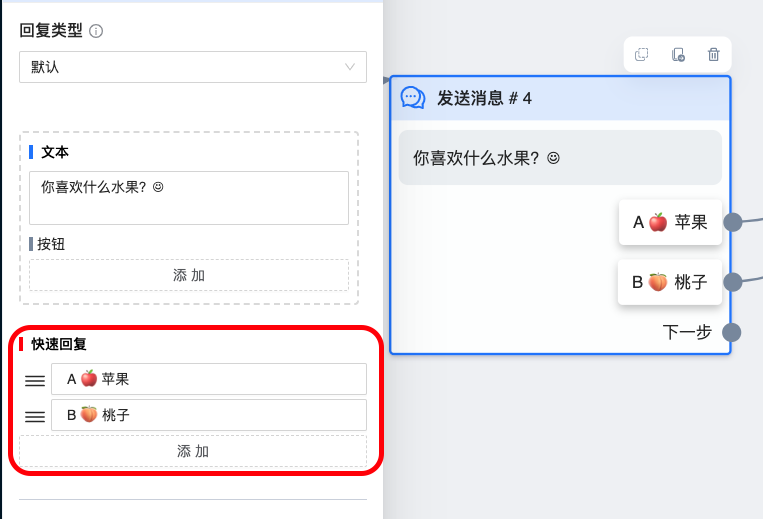
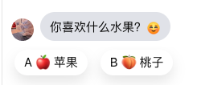

# 快速回复按钮组件

提供可一次性点击且样式优美的悬浮按钮，通常配合 `文本组件` 使用

## 图鉴

fb 中的实际效果

## 使用说明

不能单独使用，必须配合其他组件使用,并且只能作为节点的最后一个组件。

我们通常将 `文本组件` 和 `快速回复按钮` 配合使用。虽然 `文本组件` 中也有按钮，但使用后会限制文字内容无法超过 `640` 个字，所以使用 `快速回复按钮` 替代普通按钮时，文字内容能更多，达到 `2000` 个字

按钮的设置和功能与 `文本组件` 中的[普通按钮](/guide/workflow/component/text.html#创建普通按钮)基本一致。

### 快速回复按钮和普通按钮的区别

- 外观上快速回复按钮 `更好看`

- 快速回复按钮 `只能点击一次`，而普通按钮不限次数

- 快速回复按钮被点击一次或其下方有任何一条新信息出现时就会 `消失`，无法再被点击。普通按钮不会消失

- 快速回复按钮最多能有 `13` 个，而普通按钮最多只有 `6` 个
