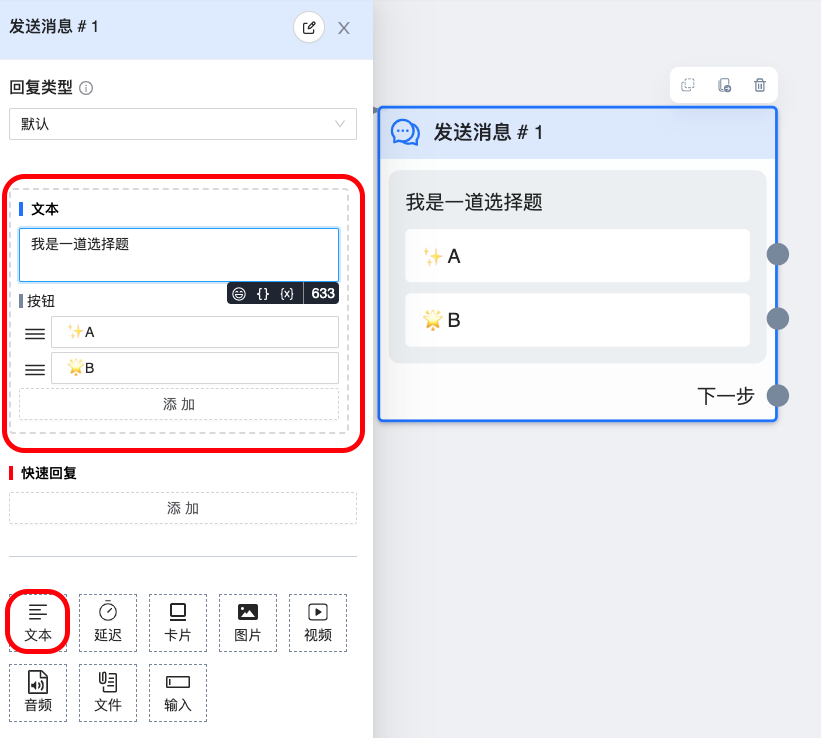
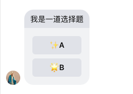
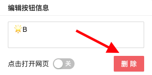

# 文本组件

用于发送纯文本或带按钮消息，带按钮时最多有 `640` 字，不带按钮时最多 `2000` 字

## 图鉴

fb 中的实际效果

## 使用说明

### 创建普通按钮

在文本输入框中放入要发送的文字内容，点击按钮下方的「添加」按钮可以创建一个按钮。点击新增的按钮会出现一个小框显示按钮的标题，你可以修改标题成你想要显示的内容，如 `✨A`。注意按钮标题字数不能超过 20 个字

### 创建跳转链接按钮

在创建普通按钮的基础上，在点击按钮弹出的小框中，打开「点击打开网页」开关，然后在「跳转链接」输入框中输入要跳转的链接

### 统计跳转链接按钮的点击次数

`普通按钮` 的点击次数系统都能统计到，但 `跳转链接按钮` 的按钮需要手动开启统计功能。开启「跳转链接」输入框右上角的 `是否统计` 开关，之后就能统计到用户的点击次数。但有一点需要注意，开启统计按钮后，用户点击按钮跳转时会收到 `fb` 警告「你即将前往 fb 以外的链接...」，从而导致用户不敢点击，最终流失部分用户，所以请慎用此功能

### 如何删除按钮

点击按钮，在弹框的右下角有一个红色的「删除按钮」，点击即可

>⚠️注意按钮后必须连接一个节点，这是因为 fb 政策要求用户点击按钮后都能有回馈，以此保证良好的用户体验