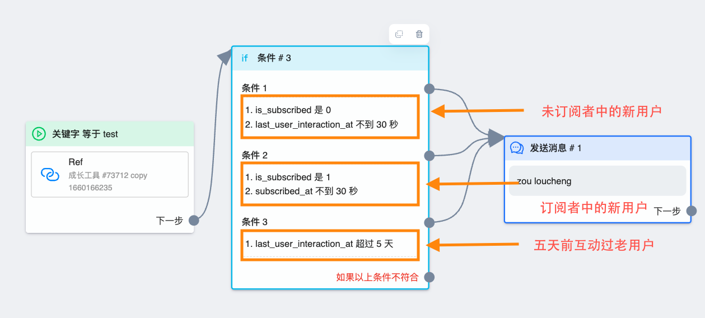

# 演示案例

通过本章学习，你将学会创建一套拥有频率限制的问答流程

## 前提

* 拥有一个 `管理员` 或  `普通用户` 权限的账户

## 录屏

<iframe width="560" height="315" src="https://www.youtube-nocookie.com/embed/4myo7AxixkU" title="YouTube video player" frameborder="0" allow="accelerometer; autoplay; clipboard-write; encrypted-media; gyroscope; picture-in-picture; web-share" allowfullscreen></iframe>

## 开始

### 创建工作流

如果你已经创建好了成长工具，可以进入成长工具编辑页面 > 「工作流选择」, 再通过点击「编辑」按钮进入工作流编辑页面

如果没有成长工具也不用担心，点击页面最左侧导航 「自动化」 > 「工作流」，然后点击页面右上方的「新增工作流」按钮创建一个新工作流

### 删除默认消息节点

将鼠标放至消息节点上方，点击右上方的「垃圾桶」按钮，即可删除节点。如果是手动创建工作流，不会有默认消息节点，可以跳过此步骤

### 创建第一个消息节点

有两种方式创建节点：

- 点击 `触发器` 节点的「下一步」,会产生一条线，然后移动鼠标拖拽线头，注意需要 `按住不松手`，移动到合适位置时放开鼠标。然后会出现一个选择列表，点击第一个 `发送消息` 按钮即可创建消息节点

- 网页最右侧有四个白色悬浮按钮，点击最下方的按钮，同样也会产生一个选择列表，点击第一个 `发送消息` 按钮即可创建消息节点。以这种创建后，记得连接触发器节点。

### 设置消息节点

单击刚创建的消息节点，会看到页面左侧滑出一个栏目，这是节点的设置区域。

1. 设置节点时，第一步需要先考虑自己的使用场景，如果是用于评论的第一条消息，那么务必得修改节点的 `回复类型` 为评论回复。除此以外的情况，使用 `默认` 即可。本章学习，我们假设此工作流用于评论，所以需要修改类型。

1. 鼠标放至 `文本组件` 上方，点击出现的叉号来删除默认的文本组件。新创建的消息节点中都会默认生成一个 `文本组件`，因为我们设置的问答流程需要支持用户手动发消息答题，文本组件达不到，所以删除它，改用[输入](/guide/workflow/component/input.md)组件

1. 点击设置区域下方的 `输入` 组件图标，生成组件。

1. 在 `输入组件` 的文字输入处，输入我们的提问 「你喜欢吃什么水果？」，然后点击文字下方的「添加」按钮来增加选项，如增加 「A. 🍎 苹果」、「B. 🍑 桃子」

1. 再次点击文字输入框，并在右侧的输入组件设置框中勾选 「允许用户手动输入」

1. 在「条件匹配」中添加一个条件，在输入框中输入 `A`,然后点击 「确定」 保存

1. 然后点击「添加另一个条件」按钮，在输入框中输入 `B`,然后点击 「确定」 保存。增加这两个条件的目的是为了让用户手动发送的 `A`、`B` 也能正确触发流程

### 创建后续消息节点

以第一种创建节点的方式，从 `A. 🍎 苹果` 按钮后的圆点拉出一条线，创建一个 `发送消息` 节点，并在默认生成的 `文本组件` 中输入 「我也喜欢吃苹果」。然后将「条件1」后的圆点链接到刚刚创建的节点上。

同理，从 「B. 🍑 桃子」 按钮后的圆点拉出一条线，创建一个 `发送消息` 节点，并输入 「我也喜欢吃桃子」。然后将「条件2」后的圆点链接到刚刚创建的节点上。

这一步的作用是给按钮指定了下一步流程，让用户点击按钮或者手动选择后能继续走流程

### 添加频率限制

到此为止，工作流已经可以发布使用了，但能用不是本章教程的唯一目的，接下来要针对使用中存在的实际问题——重复触发，来做频率限制

1. 首先删除[触发器节点](/guide/workflow/concepts.md#触发器、节点、组件分别是指什么)和第一个消息节点的连线.将鼠标放在连线上，然后点击，会出现一个 `垃圾桶` 按钮，点击即可删除连线

1. 然后从 `触发器节点` 的「下一步」出拖拽出线头，松开手后点击选择框中的第二种类型：[条件](/guide/workflow/node/condition.md)

1. 在条件节点中根据下图设置条件。这样的条件设置能保证每个新用户和部分老用户可以触发流程，减少了不必要的发送次数，能尽可能避免出现因触发频率太高而受限和用户反感问题

1. 设置完成后，将各个条件后的圆点连接至第一个创建的消息节点上。注意条件节点最下方的「如果以上条件不符合」不需要连接

::: tip
按住 Shift 并用鼠标框选多个节点，可以批量移动节点
:::
### 发布流程

点击页面右上角「发布」按钮。只有发布后，工作流的改动才会正式生效，否则只是草稿。

💐💐💐 恭喜你，你已成功创建一套工作流，希望接下来你能根据自己的使用情况创建一套属于你自己的工作流
