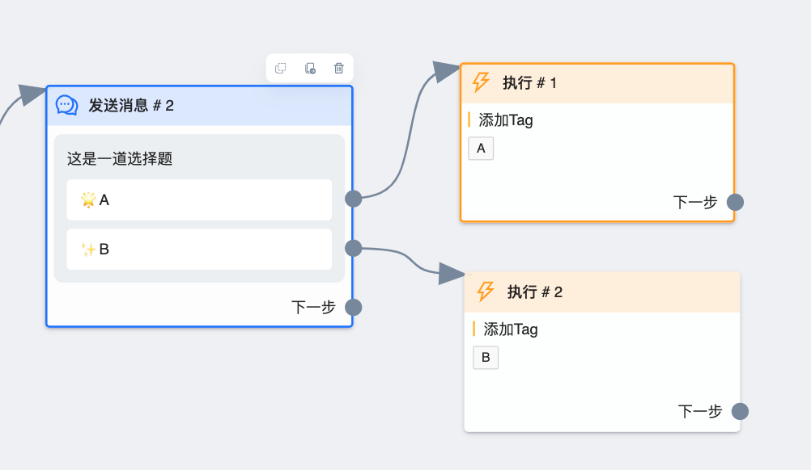

# 执行节点

目前可以通过此节点给线索做标记，用于数据分析。此节点也可以扩展更多功能，如有需要，可以反馈

## 图鉴

一个执行节点由 `标题`、`执行体` 两部分组成。后续节点基本也由这两部分组成，之后就不再赘述

### 执行体

`执行体` 中可以执行多个 `操作`，比如打上多个标签，删除多个标签。对于操作的数量，没有限制。

## 操作说明

### 添加 Tag

给触发此节点的线索打上标记。通常用于按钮之后，比如上图，给点击 `A` 按钮的用户打上 `A` 标签, 便于后期数据统计，可以根据 `A` 标签的数量判断选 `A` 的人数

### 删除 Tag

一般用于清除上次流程的标记。比如流程中用标签限制 `普通按钮` 只能点击一次，如果在第二次触发流程时不删除标签，用户点击按钮就无法继续往下走。
