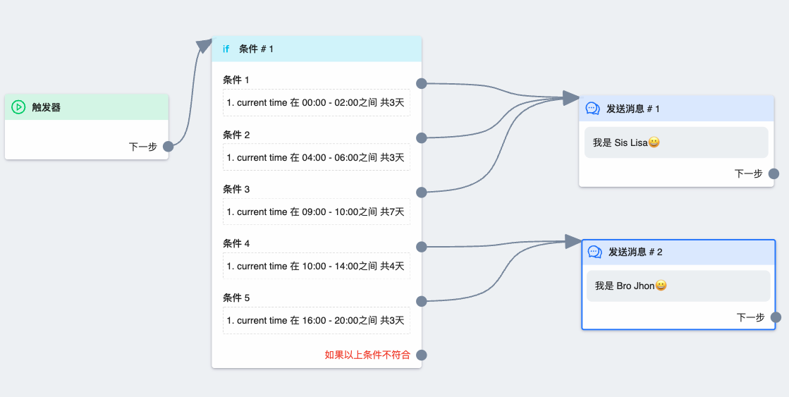

# 条件节点

`条件节点` 是除了消息节点外最常用到的节点，如果想要根据不同情况发消息，就必须用到条件节点，所以掌握其用法，是精通工作流的前提。

## 图鉴

一个条件节点由 `标题`、`条件体` 两部分组成。

### 条件体

条件体中可以设置多种条件。多个条件也可以合成一组，每一组条件后都有一个圆点，用于指定满足这组条件时走的流程。
我们先来看看各个条件之间的关系：

- `同一组` 中的条件关系是 `且`，也就是必须同时满足，这一组条件才算成立。如上图条件一中的 `subscribed_at` 不到 3 秒 和 `gender` 是 female 同时满足时，条件一才成立。

- `不同组` 的条件关系是 `或`，满足哪个就走哪个

明白条件之间的关系后，我们再来看看条件的执行顺序了。**系统是从上到下判断每一个条件的**，遇到成立的条件时就不再往下判断，也就是如果有好几组条件都满足，但是系统会选择最先满足的那一组。

## 条件说明

>⚠️以下不包含不常用、待开发的条件

### tag

中文为 `标签`，用于判断用户是否有某一个标签。我们可以给点了按钮的用户打上标记，然后在流程开头就判断是否有标记，有标记就不继续走流程。这样就能达到只限制用户触发一次流程。

### current_time

中文为 `当前时间`，用于设置指定时间段走流程。注意时间是有时区之分的，请在 `专页设置` 中设置时区为你本地时区或传福音地区的时区。在此条件的 `在其中间` 条件时，如果开始时间大于结束时间，会跨天到第二天。如 `18:00 ~ 02:00`, 指的是当天的 18:00 到 第二天的 02:00。

### full_name

中文为 `全名`, 根据线索名字进行过滤。没有使用这个作为过滤条件的场景，就不做详细介绍了

### gender

`性别`

### subscribed_at

`订阅时间`，指的是用户第一次在畅聊后台发信息的时间。通常用 `subscribed_at 小于 3 秒` 来判断是否为新用户

### last_user_interaction_at

`上次互动时间`，聊天记录中最后一条信息的时间。通常用 `last_user_interaction_at 大于 3 天` 来限制老用户最多三天触发一次流程，避免重复触发引起反感

### is_subscribed

`是否订阅`，如果为 0，是 `非订阅者`。如果是 1，是 `订阅者`

## 常用模板

### 只有新用户触发

### 只有老用户触发

### 新老用户分别走流程

### 所有人最多每小时触发一次

### 新用户和一天之前互动过的老用户才能触发流程

### 新用户和五天前互动过的用户才触发流程（包括未订阅用户也是五天）

>推荐使用此模板，因为能限制非订阅者老用户触发频率，最大限度减少发送次数，尽可能避免出现因触发频率太高而受限和用户反感问题

### 根据时间段发畅聊信息

