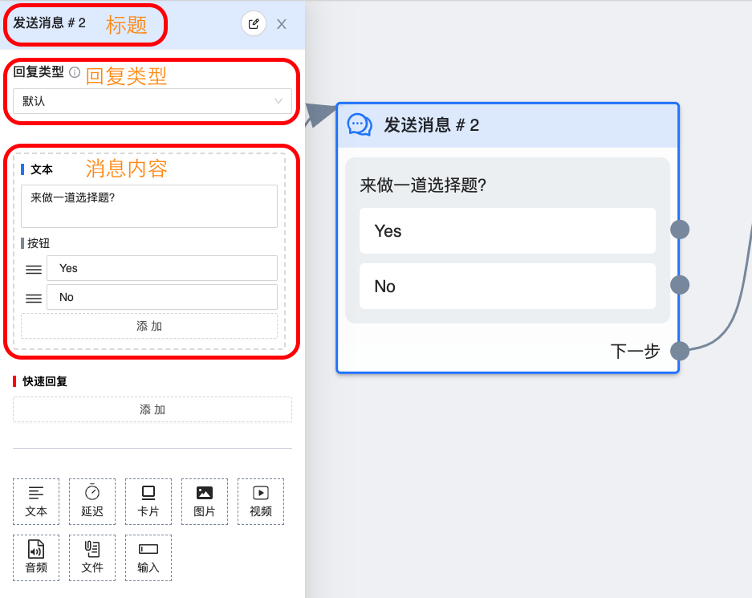

# 发送消息节点

`发送消息` 节点是用于设置消息内容的，你可以使用节点中的不同组件发送多种类型的信息，比如文本、图片、正在输入气泡、音频、按钮等。

## 图鉴

一个消息节点由 `标题`、`消息类型`、`消息内容` 三部分组成。

### 标题

一般情况下，无需修改标题，如果是流程复杂时，可以点击标题右侧的小笔图标自定义标题。比如根据时间段发送信息时，可能会在条件节点后连接多个消息节点，如果节点上分别标注是哪个时间段的，会使工作流非常清晰、易读。

### 消息类型

有 `默认`、`评论回复` 两种类型。在 `触发器` 为评论成长工具的流程中第一个消息节点的类型**必须**是评论回复, 否则第一条消息一定会发送失败。除此之外，消息类型都需要为默认。

### 消息内容

通过拖拽或点击各种组件，排列组合而成。组件的排列顺序就是消息的发送顺序。每种组件的字数还有类型都完全遵循 `Facebook` 的规范做了限制，比如 `文本` 组件最多只能有 3 个按钮，没有按钮时最多放 2000 个字。还有，当 `消息类型` 为 `评论回复` 时，一个节点中只能放一个组件，也就是只能发一条信息。

>🔔 关于消息内容部分的设置放到 [组件](../component/text.md) 章节详细介绍