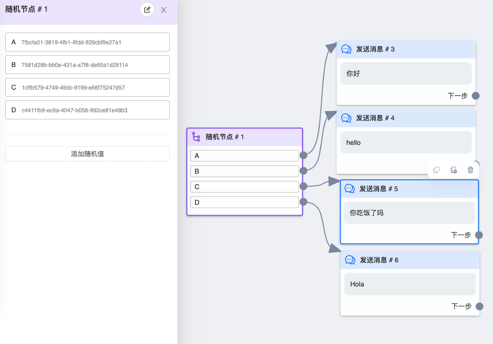
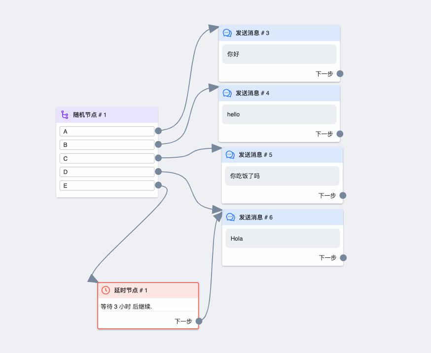

# 随机节点

使用此节点可以随机选取后续流程发送，避免线索每次走流程时发送同样的消息

## 图鉴

## 使用说明

点击 `添加随机值` 按钮会添加一个 `分支`，每个分支被选中的概率是平均的，如上图一共有四个分支，每个分支的概率为 25%，发送 `A` 分支后的「你好」消息的概率就是 25%。

💡 除了随机发消息这种用法外，还可以用于 `限流`，也就是只让部分用户走流程。因为每个分支的概率是 `平均` 的，所以很容易控制走流程的用户比例。比如我想让 80% 的用户走流程，可以设置五个分支，然后四个分支后连接流程，一个分支留空，也就是 20% 用户不发消息。留空的分支也可以选择配合 `延时节点` 延迟发送。这样做的目的是减少高峰期流量，导致 API 速率受限。

