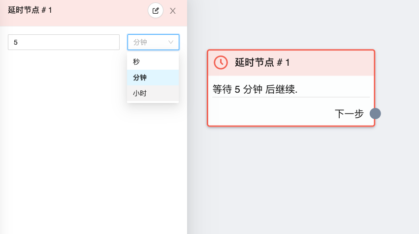

# 延时节点

使用此节点可以延迟发送信息给用户，模拟了等待和输入的过程，使得流程更加真实

## 图鉴

## 使用说明

延迟时间有三种单位，`时`、`分`、`秒`，因为受限于 `fb` [24 小时政策](
    https://developers.facebook.com/docs/messenger-platform/reference/send-api/
    )，所以最大延迟时间不能超过 24 小时