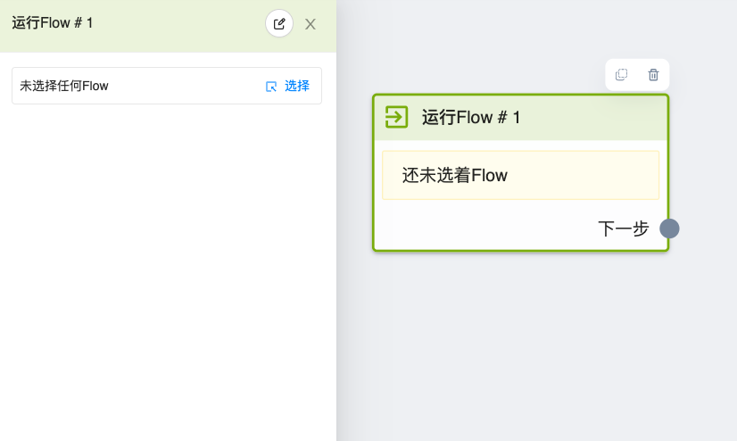

# 运行工作流节点

使用此节点，可以引入别的工作流，也就是跳入另一个工作流中。`运行工作流节点` 是为了重复利用工作流而出现的。

设想你正在使用两套流程，两套流程中都需要发接线客服卡片。每次客服有变动时，就需要分别在两个流程中改动。如果将发卡片部分制作成一个单独的流程，然后在原先的流程中使用 `运行工作流节点` 来引入，这样之后再有客服变动时，只需要在卡片流程中改动一次，节省了时间。

## 图鉴

## 使用说明

点击「选择」按钮，挑选一个要跳转的工作流
